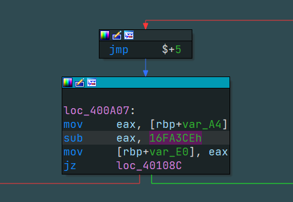

原 README.md : https://github.com/cq674350529/deflat
# 运行与调试
```shell
z flat_control_flow
python3 deflat.py -f samples/bin/check_passwd_x8664_flat --addr 0x400530
```

# 名词解释

## supergraph

am_graph.py脚本来自于angr-management/utils/graph.py，用于将CFG转换为supergraph，因为angr框架中CFG与IDA中的不太一样。

> A super transition graph is a graph that looks like IDA Pro's CFG, where calls to returning functions do not terminate basic blocks.

也就是A块的出口只能到B(比如jmp) 这两个加起来就是个超级块 因为没有其他路径可以走
```c
.text:0000000000400A02                 jmp     $+5
.text:0000000000400A07 ; ---------------------------------------------------------------------------
.text:0000000000400A07
.text:0000000000400A07 loc_400A07:                             ; CODE XREF: main+222↑j
.text:0000000000400A07                 mov     eax, [rbp+var_A4]
.text:0000000000400A0D                 sub     eax, 16FA3CEh
.text:0000000000400A12                 mov     [rbp+var_E0], eax
.text:0000000000400A18                 jz      loc_40108C
```




